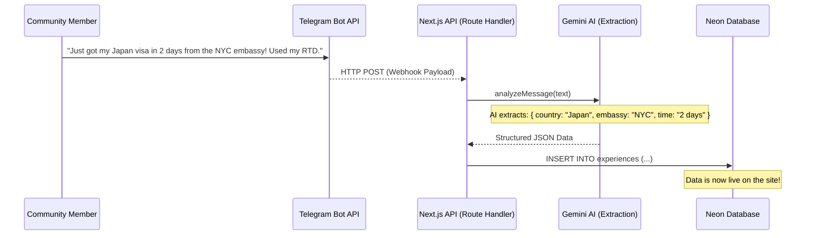
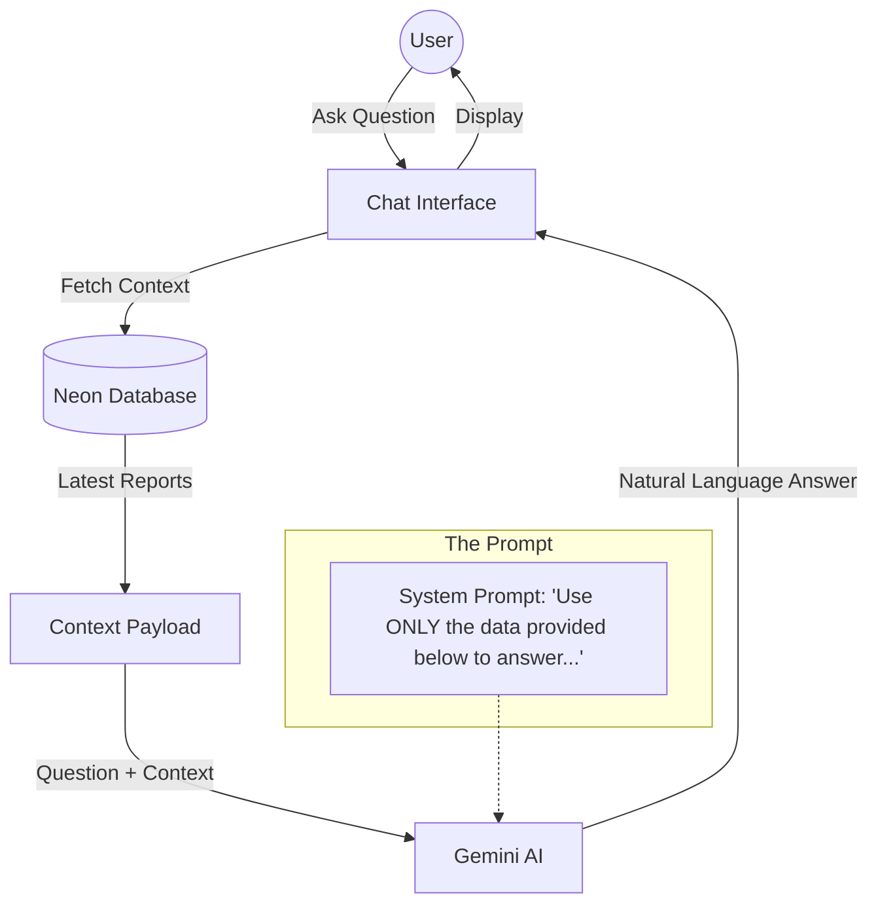

# AI Integration Architecture

This document describes the flow for automatically capturing community travel reports from Telegram and surfacing them through an AI Chatbot.

## 1. Automated Data Capture Flow

This sequence shows how a casual message in the Telegram group becomes a structured data point in our database.

## 2. AI Chatbot Query Flow (RAG)

This shows how the chatbot uses the community data to answer user questions.

## Key Technologies
- **Gemini 1.5 Flash:** For lightning-fast data extraction and natural language answers.
- **Telegram Bot API:** To listen to group messages.
- **Neon PostgreSQL:** The persistent source of truth for community wisdom.
- **Next.js Route Handlers:** To handle the incoming webhooks from Telegram.
